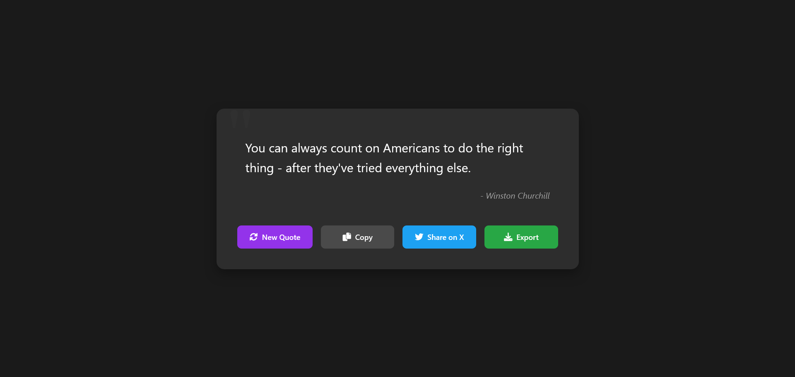

# 🌟 Random Quote Generator

A beautiful, modern random quote generator with a sleek dark theme interface. Built with HTML, CSS, and JavaScript, this application provides an elegant way to discover, copy, share, and export inspiring quotes.



## ✨ Features

- **🎯 Random Quotes**: Fetch inspiring quotes from a vast collection
- **🌙 Dark Theme**: Easy on the eyes with a modern dark interface
- **📋 Quick Copy**: Copy quotes with a beautiful selection animation
- **🐦 Share on X/Twitter**: Instantly share quotes on social media
- **📸 Export as Image**: Save quotes as beautiful PNG images
- **🎨 Beautiful UI**: Sleek animations and visual feedback
- **📱 Responsive Design**: Works perfectly on all devices

## 🚀 Live Demo

[View Live Demo](https://randomquotees.netlify.app/)

## 🛠️ Technologies Used

- HTML5
- CSS3
- JavaScript (ES6+)
- [html2canvas](https://html2canvas.hertzen.com/) - For image export
- [Font Awesome](https://fontawesome.com/) - For beautiful icons

## 🎯 Key Features Explained

### Dynamic Quote Loading

- Fetches random quotes from an API
- Smooth loading animations
- Error handling with user feedback

### Copy Functionality

- One-click copy to clipboard
- Visual selection feedback
- Success notifications

### Export Options

- High-quality PNG export
- Twitter sharing integration
- Clean, styled screenshots

## 🌈 User Interface

- **Dark Theme**: Comfortable reading experience
- **Responsive Design**: Mobile-first approach
- **Smooth Animations**: Polished user interactions
- **Visual Feedback**: Clear action confirmations

## 💻 Installation & Usage

1. Clone the repository:

   ```bash
   git clone https://github.com/naitikprajapati1/random-quotes-generator
   ```

2. Open `index.html` in your browser

3. Start generating and sharing quotes!

## 🎨 Customization

You can customize the appearance by modifying:

- Color scheme in CSS variables
- Font styles
- Animation durations
- Container sizes

## 🤝 Contributing

Contributions are welcome! Feel free to:

1. Fork the repository
2. Create a new branch
3. Make your changes
4. Submit a pull request

## 👨‍💻 Author

**Naitik**

- Built with ❤️ and JavaScript
- Focus on user experience and clean design
- Implemented modern web practices

## 🙏 Acknowledgments

- Quote API provided by [FreeAPI](https://freeapi.app)
- Icons by Font Awesome
- Inspired by modern design principles

---

Made with ❤️ by Naitik | © 2025
